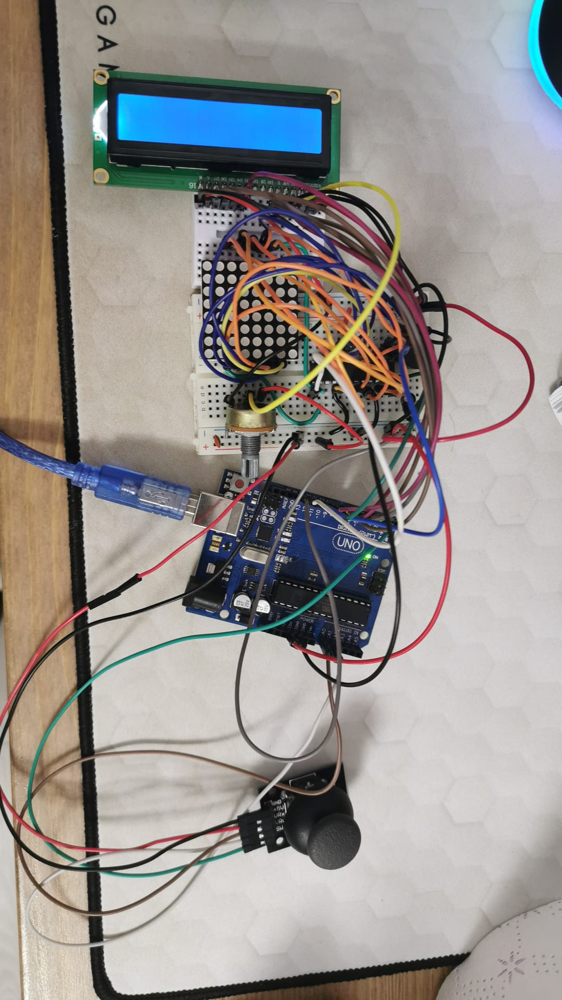

#                                                            Dance Dance Revolution

## Components
* 8x8 logical and physical matrix x1
* joystick x1
* LCD x1
* buzzer x1
* potentiometer x1
* max7219 driver x1
* capacitor x2
* Resistors
* Wires

## Technical Task
# Menu Requirements
• Menu Task: Create a menu for your game, emphasis on ‘the game. You
should scroll on the LCD with the joystick. Remember you have quite a
lot of flexibility here, but do not confuse that with a free ticket to slack
off. The menu should include the following functionality:
1. Intro Message - When powering up a game, a greeting message
should be shown for a few moments.
2. Should contain roughly the following categories:
(a) Start game, starts the initial level of your game
(b) Highscore:
– Initially, we have 0.
– Update it when the game is done. Highest possible score
should be achieved by starting at a higher level.
– Save the top 3+ values in EEPROM with name and score.
(c) Settings:
– Enter name. The name should be shown in highscore. Maybe
somewhere else, as well? You decide.
– LCD brightness control (mandatory, must change LED wire
that’s directly connected to 5v). Save it to eeprom.
– Matrix brightness control (see function setIntesnity from the
ledControl library). Make sure to display something on the
matrix when selecting it. Save it to eeprom.
– Sounds on or off. Save it to eeprom.
– Extra stuff can include items specific to the game mechanics,
or other settings such as chosen theme song etc. Again, save
it to eeprom. You can even split the settings in 2: game
settings and system settings.
(d) About: should include details about the creator(s) of the game.
At least game name, author and github link or user (use scrolling
text?)
(e) How to play: short and informative description
3. While playing the game: display all relevant info
– Lives
– Level
– Score
– Time?
– Player name?
– etc
4. Upon game ending:
(a) Screen 1: a message such as ”Congratulations on reaching level/score
X”. ”You did better than y people.” etc. Switches to screen 2
upon interaction (button press) or after a few moments.
(b) Screen 2: display relevant game info: score, time, lives left etc.
Must inform player if he/she beat the highscore. This
menu should only be closed by the player, pressing a button.

# Game requirements
• Game requirements:
– Minimal components: an LCD, a joystick, a buzzer and the led
matrix.
– You must add basic sounds to the game (when ”eating” food, when
dying, when finishing the level etc). Extra: add theme songs.
– Each level / instance should work on 16x16 matrix. You can apply
the concept of visibility / fog of war (aka you only see 8x8 of the
total 16x16 matrix, and you discover more as you move around) or
you can use the concept of ”rooms”. Basically you will have 4 rooms
that you need to go through on each level.
– It must be intuitive and fun to play.
– It must make sense in the current setup.
– You should have a feeling of progression in difficulty. Depending
on the dynamic of the game, this is done in the same level or with
multiple levels. You can make them progress dynamically or have
a number of fixed levels with an endgame. Try to introduce some
randomness, though.

## Setup

## Video
https://youtu.be/wEdHfNg2_LQ
